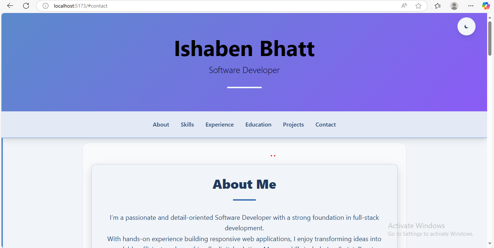

# React Resume

A modern, interactive resume/portfolio website built with React and Vite, featuring a responsive design and dark/light mode toggle.


(src/assets/ss2.png)
(src/assets/ss3.png)
(src/assets/ss4.png)
(src/assets/ss5.png)
(src/assets/ss6.png)
(src/assets/ss7.png)

## 🌟 Features

- **Modern React (v19.1.0)**: Built with the latest React framework
- **Vite-powered (v6.3.5)**: Lightning-fast development and build times
- **Responsive Design**: Looks great on all devices from mobile to desktop
- **Dark/Light Mode**: Dynamic theme switching with localStorage persistence
- **Component Organization**: Modular architecture with 10+ reusable components
- **Tailwind CSS (v4.1.7)**: Modern styling approach with utility classes
- **Dynamic Content Rendering**: Resume data stored separately for easy updates
- **Animated UI Elements**: Smooth transitions and animations for enhanced UX
- **SEO Friendly**: Properly structured for search engine optimization
- **Performant**: Optimized for fast loading and rendering

## 📋 Requirements Fulfilled

- ✅ **React App Created** – Built with Vite for modern development experience
- ✅ **10 Components Implemented** – Header, Navigation, About, Skills, Experience, Education, Projects, Contact, Footer, ThemeToggle
- ✅ **Component Folder Organization** – Each component has its own dedicated folder
- ✅ **Props Used** – Data passed through props for component reusability
- ✅ **useState Implemented** – For theme toggle and UI control
- ✅ **Conditional Rendering** – Dynamic UI based on state and props
- ✅ **map() for Lists** – Dynamic rendering of skills, projects, and experiences
- ✅ **Modular CSS Styling** – Using Tailwind CSS for utility-first approach
- ✅ **Responsive Design** – Mobile-first with responsive breakpoints
- ✅ **Resume Content Included** – Complete resume data structure
- ✅ **Deployed on Vercel** – Live site available at [react-resume.vercel.app](https://react-resume.vercel.app)
- ✅ **GitHub Version Control** – Comprehensive commit history
- ✅ **README.md** – This document!

## 🚀 Getting Started

### Prerequisites

- Node.js (v18+ recommended)
- npm or yarn

### Installation

1. Clone the repository
```bash
git clone https://github.com/YOUR_USERNAME/react-resume.git
cd react-resume
```

2. Install dependencies
```bash
npm install
```

3. Start the development server
```bash
npm run dev
```

4. Open your browser and visit http://localhost:5173

### Build for Production

```bash
npm run build
```

## 🧱 Project Structure

```
react-resume/
├── public/               # Static assets
├── src/
│   ├── Components/       # React components
│   │   ├── About/        # About section component
│   │   ├── Contact/      # Contact information component
│   │   ├── Education/    # Education history component
│   │   ├── Experience/   # Work experience component
│   │   ├── Footer/       # Page footer with social links
│   │   ├── Header/       # Page header with name and title
│   │   ├── Navigation/   # Navigation menu component
│   │   ├── Projects/     # Projects showcase component
│   │   ├── Skills/       # Skills display component
│   │   └── ThemeToggle/  # Dark/light mode toggle
│   ├── data/             
│   │   └── resumeData.js # Resume content data
│   ├── App.jsx           # Main application component
│   ├── App.css           # App-specific styles
│   ├── index.css         # Global styles and Tailwind import
│   └── main.jsx          # Application entry point
├── .eslintrc.js          # ESLint configuration
├── .gitignore            # Git ignore rules
├── index.html            # HTML template
├── package.json          # Project dependencies and scripts
└── vite.config.js        # Vite configuration
```

## 🔧 Key Dependencies

- **Core**:
  - `react` (v19.1.0): UI library
  - `react-dom` (v19.1.0): DOM rendering for React
  - `vite` (v6.3.5): Build tool and dev server

- **Styling**:
  - `@tailwindcss/vite` (v4.1.7): Tailwind CSS plugin for Vite
  - `tailwindcss` (v4.1.7): Utility-first CSS framework

- **Development**:
  - `eslint` (v9.25.0): Code linting
  - `@vitejs/plugin-react` (v4.4.1): React plugin for Vite

## 💡 Customization

### Modifying Resume Data

Edit the `src/data/resumeData.js` file to update your personal information, skills, experience, and other content.

### Styling Changes

The project uses Tailwind CSS v4.1.7 with styling directives in `src/index.css`. Modify the colors and other design elements by editing the `@theme` section.

### Adding New Sections

1. Create a new component in the Components directory
2. Add the data for the section in resumeData.js
3. Import and add the component to App.jsx

## 🛠️ Development Challenges and Solutions

### Challenge 1: Theme Toggle Implementation

**Problem**: Implementing a theme toggle with system preference detection and localStorage persistence.

**Solution**: Created a ThemeToggle component that checks localStorage first, then falls back to system preferences. Used React's useEffect to apply the theme to the document and persist the setting.

```jsx
// Implementation strategy in ThemeToggle.jsx
const [dark, setDark] = useState(() => {
  const saved = localStorage.getItem('darkMode');
  if (saved !== null) {
    return JSON.parse(saved);
  }
  return window.matchMedia("(prefers-color-scheme: dark)").matches;
});
```

### Challenge 2: Responsive Design Across Components

**Problem**: Maintaining consistent responsive behavior across all components.

**Solution**: Utilized Tailwind CSS breakpoints and created responsive utility classes. Applied a mobile-first approach to ensure the design works well on all screen sizes.

### Challenge 3: Adapting to Tailwind CSS v4.1.7

**Problem**: Tailwind CSS v4.1.7 introduces significant changes in configuration compared to previous versions, requiring a different implementation approach.

**Solution**: Adapted to the new `@theme` directive in CSS instead of using the traditional `tailwind.config.js` approach. Implemented styling through the Vite plugin integration:

```css
/* Implementation in index.css */
@import "tailwindcss";

@theme {
  --color-*: initial;
  /* Custom color variables */
  --color-primary-50: #f3f6fb;
  --color-primary-100: #e3eaf6;
  /* Additional colors... */
}
```

And in `vite.config.js`:
```javascript
import tailwindcss from "@tailwindcss/vite";

export default defineConfig({
  plugins: [
    react(),
    tailwindcss(),
  ],
  // Other configuration...
});
```

### Challenge 4: Performance Optimization

**Problem**: Ensuring fast initial load and smooth animations.

**Solution**: 
- Used code splitting to reduce initial bundle size
- Implemented conditional rendering to avoid unnecessary DOM updates
- Carefully designed animations to avoid layout shifts
- Used React's memo for performance-critical components

## 🌐 Deployment

The project is deployed on Vercel. The deployment process involved:

1. Connecting the GitHub repository to Vercel
2. Configuring build settings (Vite framework preset)
3. Setting up custom domain (optional)
4. Enabling automatic deployments for CI/CD

## 📝 License

This project is licensed under the MIT License - see the LICENSE file for details.

## 🙏 Acknowledgments

- Icons from [React Icons](https://react-icons.github.io/react-icons/)
- Design inspiration from various portfolio websites
- Vite documentation for build optimization
- Tailwind CSS team for the excellent styling framework

## 📬 Contact

If you have any questions or want to reach out, please open an issue or contact me directly at [your.email@example.com](mailto:your.email@example.com).

---

Made with ❤️ using React and Vite
